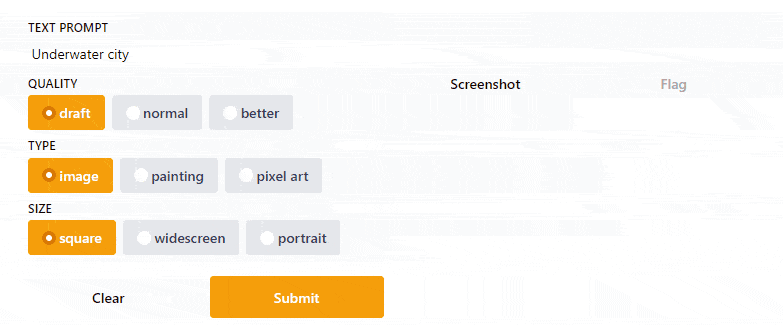

 

  

  <h3 align="center">Text2Art</h3>

  

    AI Powered Text-to-Art Generator
     
    <a href="https://text2art.com"><strong>Try It Out »</strong></a>
     
    
    ·
    <a href="https://towardsdatascience.com/how-i-built-an-ai-text-to-art-generator-a0c0f6d6f59f">Read Article</a>
    ·
    <a href="https://github.com/mfrashad/text2art/issues">Report Bug</a>
    ·
    <a href="https://github.com/mfrashad/text2art/issues">Request Feature</a>
  

<!-- ABOUT THE PROJECT -->
## About The Project

Text2Art is an AI art generator powered with VQGAN + CLIP and CLIPDrawer models. You can easily generate all kind of art from drawing, painting, sketch, or even a specific artist style just using a text input. You can also specify the dimensions of the image. The process can take 3-20 mins and the results will be emailed to you.

You can read the write-up on how I built this project in this [article](https://towardsdatascience.com/how-i-built-an-ai-text-to-art-generator-a0c0f6d6f59f)

### Built With

* Python
* VQGAN + CLIP
* CLIPDraw
* [dribnet/clipit](https://github.com/dribnet/clipit)
* Firebase

<!-- GETTING STARTED -->
## Getting Started

You can start with the colab notebook to generate an art manually using code. If you want to deploy a website like text2art, make sure you setup your MailGun and Firebase account and replace the API key accordingly.

<!-- LICENSE -->
## License

See `LICENSE` for more information.

<!-- CONTACT -->
## Contact

You can drop me a message on my [Website](https://www.mfrashad.com/).
